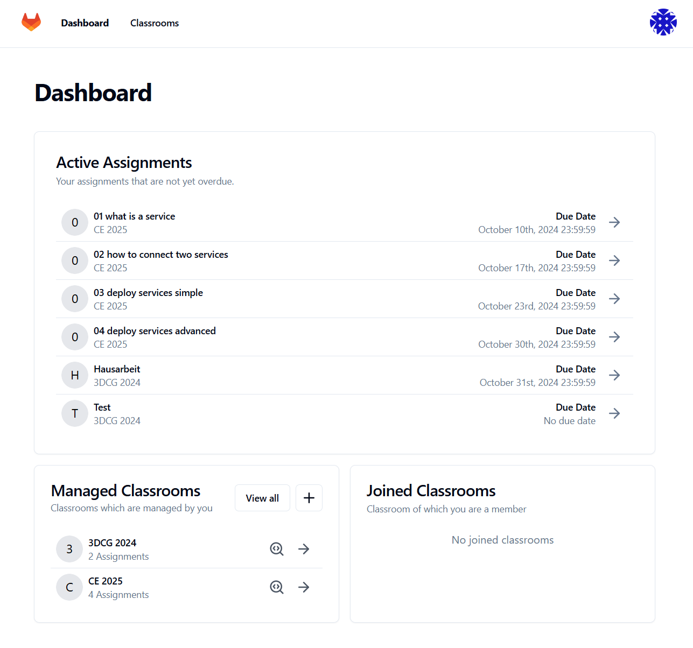

# GitClassrooms

Version: v1.0.0

This project aims to develop a teaching
tool integrated with GitLab to manage digital classrooms,
distribute assignments, and automate the grading of
students' work. Traditional learning management systems
often lack integration with version control systems like
Git, making it difficult to manage and evaluate
programming tasks. This project addresses that gap by
creating a standalone application that interacts with
GitLab's API. The solution enables instructors to create
and manage classrooms, assign programming tasks, and
implement both manual and automated grading systems.
Through features like OAuth-based authentication, team
management, and GitLab repository integration, the tool
facilitates efficient course management, offering both
autonomy and data sovereignty to educational
institutions.



## Documents

- [Project report (German)](docs/2024-09-26_GitClassrooms_ProjectReport.pdf)

## Project Structure 

The project has two parts:

- Golang with fiber as backend=> `/`
- React with Typescript and vite as Frontend => `/frontend/`

The frontend proxies the requests for the path `/api/*` to the backend server.

## Production
Docker Compose is used to deploy the application.

### Steps for deployment
1. **Cloning the repository**<br>
   Alternatively, you can directly use the docker-compose.yaml and .env.example files.
2. **Configure environment variables**
    ```bash
    cp .env.example .env
    ```
3. **Creating an application in GitLab**
   1. Create a new application in GitLab with the following Redirect URI:<br> `<PUBLIC_URL>/api/v1/auth/gitlab/callback`
   2. Set the application to confidential (Confidential: true) and select the scope "api". These are the default settings.
   3. Copy the `Application ID` and `Secret` into the `.env` file and add the URLs for `PUBLIC_URL` and `GITLAB_URL`.
4. **SMTP configuration**<br>Add SMTP credentials to send invitation emails.
5. Configure the database in the `.env` file.
6. **Starting the application**<br> To start the application and a PostgreSQL database using Docker Compose:
   ```bash
   docker compose up –env-file .env -d
   ```

Alternatively, deployment can also take place with an already present PostgreSQL server by running only the application image 

Create .env like specified above and add the database credentials of your existing database. and run the image like:

```bash
docker run -d --env-file .env --name git-classrooms -p 3000:3000 ghcr.io/git-classrooms/git-classrooms:latest
```

## Development

For development, we use the git flow branching model for simplicity.

### Setup
The Setup for development is documented in the following file
[dev_setup.md](docs/dev_setup.md)


#### Code Generation

The following file-types in our repo are auto-generated:
- mocks
- gorm-gen queries
- swagger documentation
- swagger-client

The first three types are generated when running `go generate` which is automatically executed before each build when running the app through air.

To generate the frontend `swagger-client` after some changes to the docs the following script needs to be executed:

```bash
# Linux / Mac / WSL
./script/swagger-codegen.sh
# Windows
./script/swagger-codegen.ps1
```

### Run dev image locally

To test the completely build image locally you can use the following command:

```bash
docker compose -f docker-compose.dev.yml up --build
```

And access the application via `http://localhost:3000`

### Swagger-UI testing (recommended)

1. Run the app described in [Dev-Setup](docs/dev_setup.md#start-the-application)
2. Add [Swag](https://github.com/swaggo/swag/?tab=readme-ov-file#api-operation) comments directly above your endpoint
3. Visit the page `http://localhost:5173/docs.html`
4. Click on the `Sign-In`-Button on the top-right
5. Get your csrf-token
6. Test your endpoints
7. Refresh page after swag-comments were edited

### Postman testing (not recommended)

1. Login via gitlab in the browser
2. Copy the session_id cookie from the browser to your postman environment
3. Copy the csrf_ cookie from the browser to your postman environment
4. Add the following header to your `POST|PUT|PATCH|DELETE` requests:
    - `X-CSRF-Token: {{csrf_}}`

### Writing Tests

...

To run the test simply exec the following script:
```bash
# Linux / Mac / WSL
./script/test_backend.sh
./script/test_frontend.sh
# Windows
./script/test_backend.ps1
./script/test_frontend.ps1
```

## Environments

We have to environments:

- Staging: `https//staging.hs-flensburg.dev`
